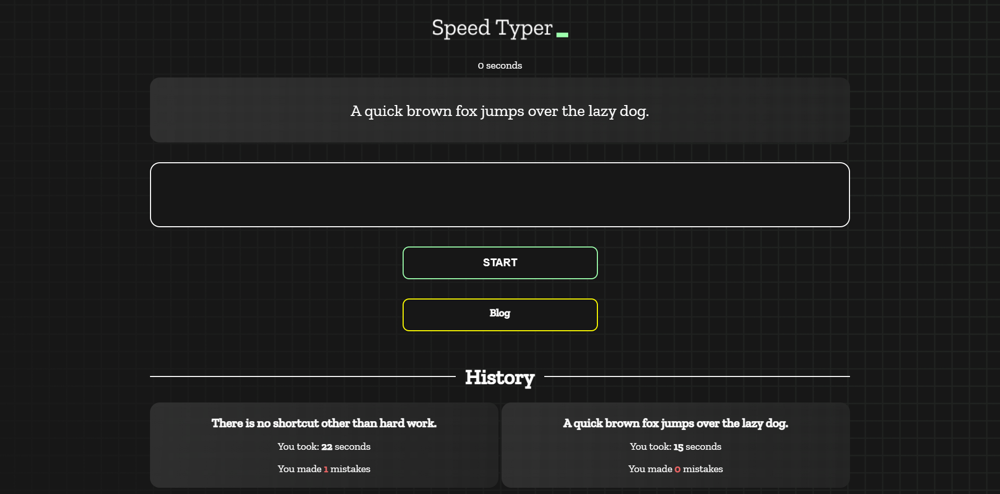

# Assignment-7 (Speed Monster)

[Project Live Link](https://simpletypingspeedtest.netlify.app/)

1. Project Setup Done
1. Bug Fixed

   - ID Name
   - Template LIterals
   - show-time
   - Modal
   - Type Mistakes

1. Blog Section
   - Question-1: Difference Between Local Storage, Session Storage
   - Question-2: Difference between Global scope and Block scope
   - Question-3: What is Event Loop?
   - Question-4: JavaScript Undefined Type

