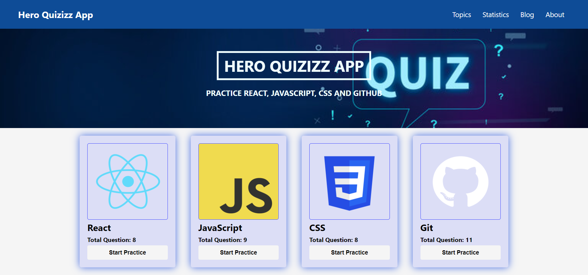

# Hero Quizizz App (Assignment-9)

#### [Website Live Link]()

1. **Project Setup**

1. **Install Library/Package**

   - React BootStrap (`npm install react-bootstrap bootstrap`)
   - React-Router-Dom (`npm install react-router-dom`)
   - HeroIcons (`npm install @heroicons/react`)
   - Recharts (`npm install recharts`)

1. **Create Components**

   - NavBar
   - Header
   - Card
   - Main
   - Blog
   - HeroSection
   - Quiz
   - QuizDetails
   - Statistics
   - Topics
   - NotFound

1. **Dynamic Load Data from API & Routing Setup**

1. **Toast Message**

